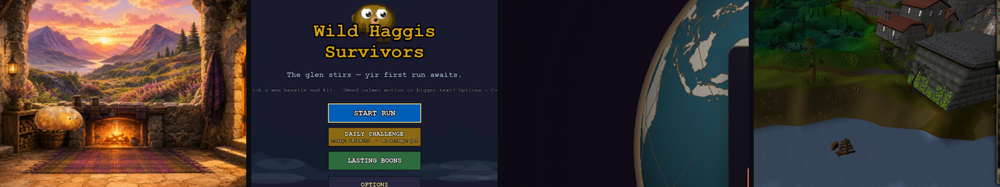
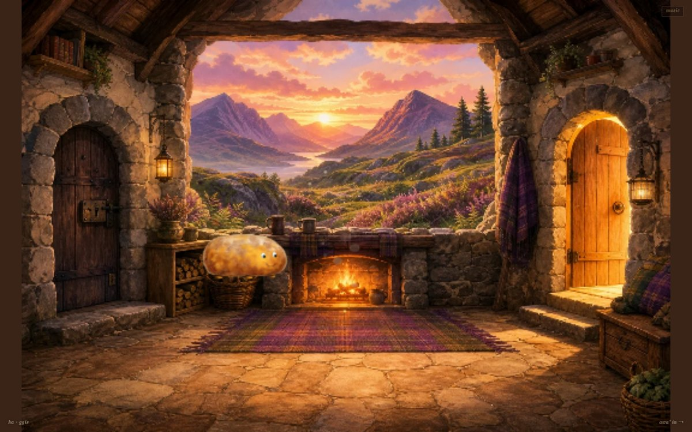
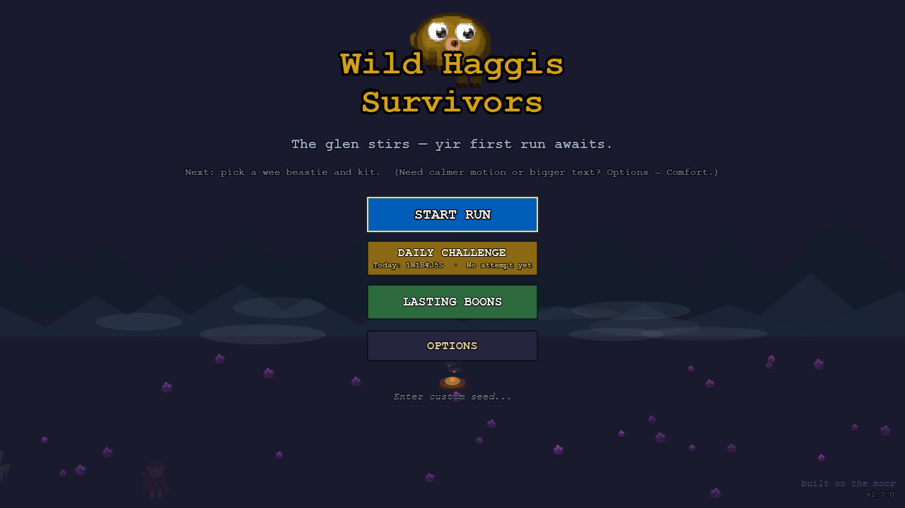

# Michael

**I make playable things, and the engines underneath them.**

Small worlds you can walk into, most of them with a Scottish accent. I work mostly in Rust and TypeScript, with a soft spot for the parts other folk skip: the deterministic core, the hash written by hand, the sprite drawn in code instead of shipped as a PNG.

### 🎮 Live now

<table>
  <tr>
    <td width="50%"></td>
    <td width="50%"></td>
  </tr>
  <tr>
    <td valign="top">
      <b><a href="https://github.com/Giftedx/ha-ggis-hub">ha·ggis Hub</a></b> 
      Walk up to a door, give it a tap, and you're in a game. <i>ha + ggis = haggis.</i> 
      Rust + WebAssembly core · hand-rolled Canvas2D renderer · strict TypeScript host 
      <a href="https://ha.ggis.xyz"><b>▶ Play it live</b></a>
    </td>
    <td valign="top">
      <b><a href="https://github.com/Giftedx/wild-haggis-survivors">Wild Haggis Survivors</a></b> 
      A Highland-at-dusk bullet heaven. Your haggis has famously uneven legs, so every step drifts a few degrees clockwise. 
      Phaser 4 + TypeScript · every sprite drawn in code · English &amp; Scots · deterministic replays 
      <a href="https://ha.ggis.xyz/wild"><b>▶ Play it live</b></a>
    </td>
  </tr>
</table>

**Also live:** [Just Five More Minutes](https://ha.ggis.xyz/just-five-more-minutes/) — a 2004-flavoured bedroom RPG with a daft wee MMO running on the CRT while your mum asks you, three separate times, to tidy your room. Three.js, generated entirely at runtime.

**Also public:** [Project-Euler-Clanker](https://github.com/Giftedx/Project-Euler-Clanker) — 138 maths problems wearing far too much architecture, after an AI got hold of them.

### 🔨 In the workshop

Private while they grow. Each one goes public when it's good and ready.

| Project | What it is |
| --- | --- |
| **AccentGuessr** | *GeoGuessr for voices.* Two players hear a stranger speak and race to pin the accent on a world map. A Rust→WASM client, a WebGPU globe built from scratch, a binary protocol of its own, and not one npm package. |
| **IdleScape** | Old School RuneScape, but idle — and playing out in an actual 3D world instead of a spreadsheet. Go tick engine, React + WebGL client. |
| **plex-for-discord** | Watch Plex together inside Discord, properly in sync. A four-crate Rust workspace with its own Discord Gateway client and a WASM/Leptos activity. |
| **Kittiwake** | A small, honest site for an off-grid hut on the Isle of Mull. Astro + Tailwind, and nothing it doesn't need. |

### 🧰 Toolbelt

---

Everything playable lives at <a href="https://ha.ggis.xyz">ha.ggis.xyz</a>. Mon then.

