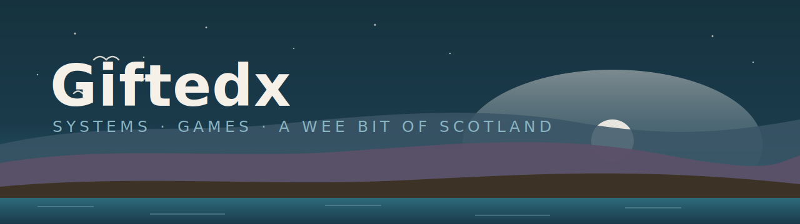

# Hi, I'm Michael 👋

**I build polished systems and playable things.**
Rust · Go · TypeScript · Python — from WebAssembly game engines to off-grid websites.
Often with a wee bit of Scotland in them.

---

### 🛠️ What I build

I like hard problems and clean execution: hand-rolled engines over heavy frameworks,
honest documentation, and software that feels good to use. Mostly games and real-time
systems — some of it quietly practical.

### ✨ Selected work

| Project | What it is |
| --- | --- |
| **ha·ggis Hub** | A playable Highland-games arcade lobby — Rust + WebAssembly core, hand-rolled Canvas renderer. *"ha + ggis = haggis."* |
| **Wild Haggis Survivors** | A *Vampire Survivors*-style browser game starring a wild haggis with a clockwise "drift" — Phaser + TypeScript. |
| **AccentGuessr** | *GeoGuessr for voices*: hear a speaker, pin their accent on a world map. Rust → WASM client, custom WebGPU renderer, server-authoritative netcode. |
| **IdleScape** | A self-directed *Old School RuneScape* idle game rendered in the real 3D world — Go engine + WebGL client. |
| **Kittiwake** | A warm, honest site for an off-grid camping hut on the Isle of Mull — Astro + Tailwind. |

> 🔒 *Several of these are in private development and rolling out publicly — links light up as each launches.*

### 🧰 Toolbelt

---

Built with care. No slop. 🏴󠁧󠁢󠁳󠁣󠁴󠁿

