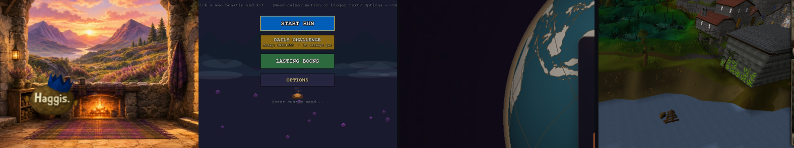
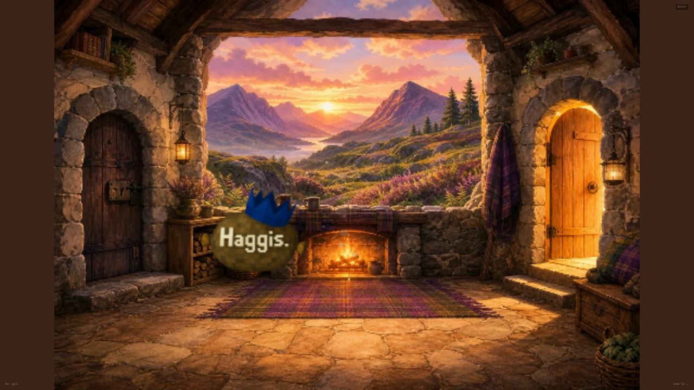
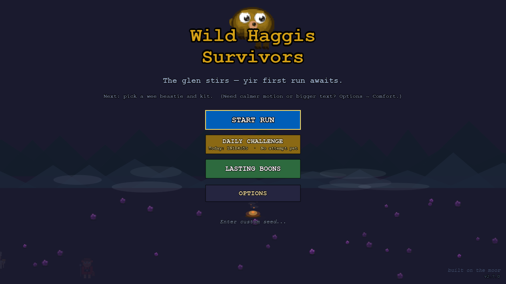
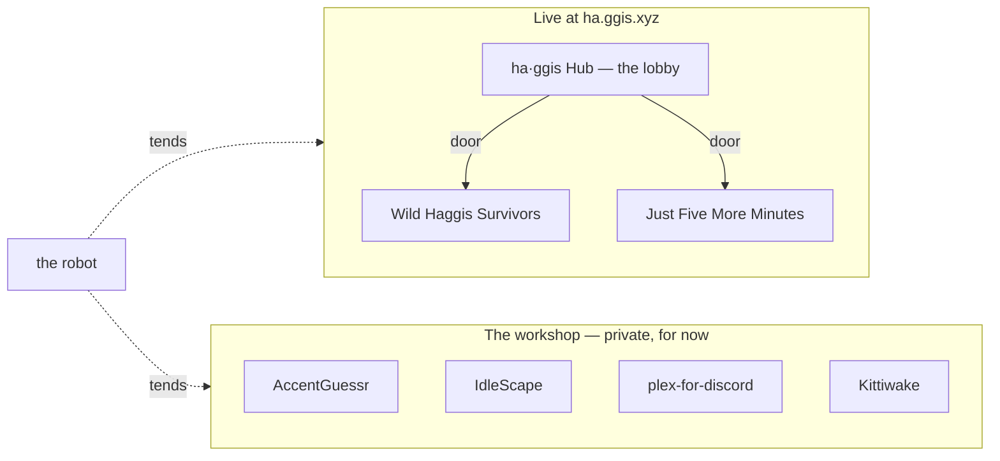

# Michael

**Systems, games, and a wee bit of Scotland.**

I make playable things, and the engines underneath them. Mostly Rust and TypeScript. I keep a soft spot for the parts other folk skip: the deterministic core, the hand-written hash, the sprite drawn in code.

## 🎮 Live now

<!-- ste-lint: off -->
<table>
  <tr>
    <td width="50%"></td>
    <td width="50%"></td>
  </tr>
  <tr>
    <td valign="top">
      <b><a href="https://github.com/Giftedx/ha-ggis-hub">ha·ggis Hub</a></b> 
      The lobby. Chap a door and you're in a game. <i>ha + ggis = haggis.</i> 
      Rust + WebAssembly core · hand-rolled Canvas2D renderer · strict TypeScript host 
      <a href="https://ha.ggis.xyz"><b>▶ Play it live</b></a>
    </td>
    <td valign="top">
      <b><a href="https://github.com/Giftedx/wild-haggis-survivors">Wild Haggis Survivors</a></b> 
      A Highland-at-dusk bullet heaven. Your haggis has famously uneven legs, so every step drifts a few degrees clockwise. 
      Phaser 4 + TypeScript · every sprite drawn in code · English &amp; Scots · deterministic replays 
      <a href="https://ha.ggis.xyz/wild"><b>▶ Play it live</b></a>
    </td>
  </tr>
</table>
<!-- ste-lint: on -->

**[Just Five More Minutes](https://github.com/Giftedx/just-five-more-minutes)**: a 2004-flavoured bedroom game. A daft wee MMO runs on the bedroom CRT while your mum asks you, three separate times, to tidy your room. Three.js, generated entirely at runtime. [▶ Play it live](https://ha.ggis.xyz/just-five-more-minutes/)

**[Project-Euler-Clanker](https://github.com/Giftedx/Project-Euler-Clanker)**: 138 maths problems wearing far too much architecture, after an AI got hold of them.

```mermaid
flowchart LR
    subgraph live["Live at ha.ggis.xyz"]
        hub["ha·ggis Hub — the lobby"] -->|door| whs["Wild Haggis Survivors"]
        hub -->|door| jfmm["Just Five More Minutes"]
    end
    subgraph shop["The workshop — private, for now"]
        ag["AccentGuessr"]
        is["IdleScape"]
        pfd["plex-for-discord"]
        kw["Kittiwake"]
    end
    robot["the robot"] -.->|tends| live
    robot -.->|tends| shop
```

## 🔨 In the workshop

Private while they grow, so no links. Nothing here should 404 on you.

| Project | What it is |
| --- | --- |
| **The robot** | It scouts my repos for red CI and rough edges, writes a fix, verifies it, and ships it. A second model reviews anything that smells off. |
| **AccentGuessr** | *GeoGuessr for voices.* Hear a stranger speak, race to pin the accent on the map. Rust→WASM client, a hand-rolled WebGPU globe, zero npm packages. |
| **IdleScape** | Old School RuneScape, but idle — in an actual 3D world instead of a spreadsheet. Go tick engine, React + WebGL client. |
| **plex-for-discord** | Watch Plex together inside Discord, properly in sync. A four-crate Rust workspace with its own Discord Gateway client. |
| **Kittiwake** | A small, honest site for the family's off-grid hut on the Isle of Mull. Astro + Tailwind, and nothing it doesn't need. |

## 🧰 Toolbelt

---

Everything playable lives at <a href="https://ha.ggis.xyz">ha.ggis.xyz</a>. Mon then.

